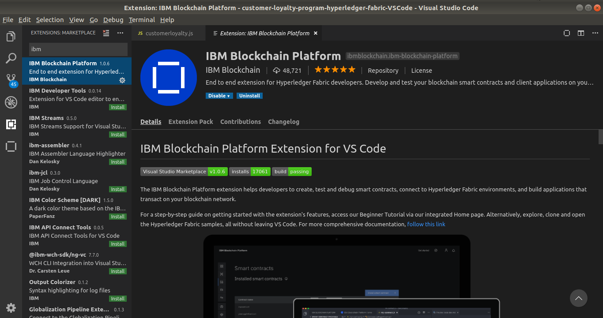

# IBM Blockchain Platform - Blockchain Summit 2019


En este repositorio encontrará los pasos para la etapa del hands-on de IBM Blockchain Platform. 


<p align="center">
  
</p>


## Prerrequisitos


Durante el hands-on no dedicaremos tiempo a la instalación y configuración de los siguientes prerrequisitos.


### 1 - Visual Studio Code


Utilizaremos Visual Studio Code como nuestro editor de código y además, instalaremos allí la extensión de IBM Blockchain para generar nuestro smart contract (chaincode) y configurar y desplegar nuestra red a través de una interfaz gráfica. 


Link de descarga [aqui](https://code.visualstudio.com/Download)


### 2 - IBM Blockchain Platform - Extención para VS Code 


Una vez que tengamos instalado Visual Studio Code, descargamos la extensión IBM Blockchain Platform. Para descargarla, debemos dirigirnos a la pestaña "extensiones" en el menú lateral izquierdo de Visual Studio Code, y luego, en el buscador, escribir "IBM Blockchain Platform". Por último, abrimos la primera opción y hacemos clic en *install*.


  <p align="center">
    
  </p>


### 3 - Nodejs y NPM 


Descarguemos Nodejs y NPM desde [aqui](https://nodejs.org/es/download/)


### 4 - Docker y Docker-Compose


Hyperledger Fabric local funciona gracias a que se despliega dentro de contenedores Docker y es orquestada usando Docker compose. Por esto es necesario tener ambos instalados.


* 1 - Docker: Desde [Aquí](https://docs.docker.com/install/) pueden instalar Docker.
* 2 - Docker Compose: [Aquí](https://docs.docker.com/compose/install/) la documentación con los pasos para instalar Docker Compose. 


## Introducción 


En la primera etapa de este hands-on vimos una introducción a IBM Blockchain Platform. Ahora continuaremos con un par de laboratorios  con los que comprenderemos las bases de una red blockchain y los componentes de IBP. Los laboratorios que estaremos realizando son:


* Generar una red simple usando Hyperledger Fabric local e IBP.


* Desplegar localmente una red de blockchain para un programa de fidelización de clientes.


## Lab 1


### Objectivos 


* Crear un nuevo proyecto
* Generar un smart contract
* Ejecutar Hyperledger Fabric local (preconfigurado)
* Desplegar el smart contract en _local_fabric_
* Realizar transacciones con el smart contrar 


### Crear un nuevo proyecto


La extensión de IBP puede generar un esqueleto de smart contract en alguno de los lenguajes de programación compatible con Hyperledger Fabric. Con esto podremos comenzar nuestro smart contract utilizando una base y no un documento en blanco!!


1. En la barra lateral izquierda, haga clic en el icono __IBM Blockchain Platform__ (se ve como un cuadrado, y probablemente estará en la parte inferior del conjunto de iconos si esta fue la última extensión que instaló).


2. Pase el mouse sobre el panel 'Smart Contracts', haga clic en el menú '...' y seleccione 'Create New Project' en el menú desplegable.


3. Elija un lenguaje para el smart contract. JavaScript, TypeScript, Java y Go son los disponibles. A los efectos de este tutorial, elija `TypeScript`.


4. La extensión le preguntará si desea nombrar el asset en el contrato generado. Esto se configurará de manera predeterminada en `MyAsset`, pero puede utilizar el que quiera, yo lo llamare **Car** ya que quiero una red para la trazabilidad de diamantes. 


5. Elija una ubicación para guardar el proyecto. Haga clic en `Examinar`, luego haga clic en` Nueva carpeta` y asigne al proyecto el nombre que desee, yo usaré `blockchainsummit`.


6. Haga clic en `Crear` y luego seleccione la nueva carpeta que acaba de crear y haga clic en` Guardar`.


7. Finalmente, seleccione `Add to workspace`.


La extensión le generará un contrato basado en el idioma seleccionado y el nombre del asset (activo). Una vez hecho esto, puede ir a la pestaña __Explorer__ (muy probablemente el ícono superior en la barra lateral izquierda, que parece un ícono de "documento") y abrir el archivo `src/my-asset-contract.ts` para ver la estructura de código de contrato inteligente. 


### Exploremos el smart contract generado


La plantilla de código del smartcontract generado proporciona un buen ejemplo de algunas operaciones comunes para interactuar con datos en un ledger de blockchain. 
Observe las líneas que comienzan con `@Transaction`: estas son funciones que definen las transacciones de su contrato, es decir, las cosas que le permite hacer para interactuar con el ledger.


Veamos la función` createCar`:


```
@Transaction()
    public async createCar(ctx: Context, carId: string, value: string): Promise<void> {
        const exists = await this.carExists(ctx, carId);
        if (exists) {
            throw new Error(`The my asset ${carId} already exists`);
        }
        const car = new Car();
        Car.value = value;
        const buffer = Buffer.from(JSON.stringify(car));
        await ctx.stub.putState(carId, buffer);
    }
```


Los corchetes vacíos en `@Transaction ()` indican que esta función está destinada a cambiar el contenido del ledger.La función se llama `createCar` y toma` carId` y un `value`, los cuales son string. Cuando se envíe esta transacción, se creará un nuevo activo, con la clave `carId` y el valor` value`. Por ejemplo, si tuviéramos que crear "001", "Car x", entonces, cuando luego leamos el valor de la clave `001`, aprenderemos que el valor de ese estado particular es` Car x`.


Ahora, veamos la próxima transacción:


```


    @Transaction(false)
    @Returns('Car')
    public async readCar(ctx: Context, carId: string): Promise<Diamond> {
        const exists = await this.carExists(ctx, carId);
        if (!exists) {
            throw new Error(`The my asset ${carId} does not exist`);
        }
        const buffer = await ctx.stub.getState(carId);
        const car = JSON.parse(buffer.toString()) as car;
        return car;
    }


```
Esta funcion comienza con `@Transaction (false)` - el "falso" significa que esta función no está destinada a cambiar el contenido del ledger. Como puede ver, esta función solo toma `carId`, y devuelve el valor del estado al que apunta la clave.


### Empaquetar el Smart Contract


Ahora que tenemos creado nuestro contrato inteligente y conocemos las transacciones en él, podemos proceder a empaquetarlo. Los proyectos de smart contract se empaquetan en archivos `.CDS`, un tipo especial de archivo que se puede instalar en los peers de Hyperledger Fabric.


1. En la barra lateral izquierda, haga clic en el icono __IBM Blockchain Platform__.


2. Pase el mouse sobre el panel 'Smart Contracts', haga clic en el menú '...' y seleccione 'Package Open Project' en el menú desplegable.


3. Veremos un nuevo paquete en la lista, `blockchainsummit@0.0.1` (o el nombre que le a la carpeta).


El paquete que acabamos de crear se puede instalar en cualquier peer de Hyperledger Fabric. Por ejemplo, puede hacer clic con el botón derecho y elegir "Exportar paquete", luego implementarlo en un entorno de nube utilizando la consola de herramientas operativas de IBM Blockchain Platform. Nosotros no vamos a exportarlos porque desplegaremos la red localmente en el runtime que viene preconfigurado con la extensión VS Code.


### Operaciones locales


El panel `Local Fabric OPS` (en la vista de IBM Blockchain Platform) le permite ejecutar un runtime simple de Hyperledger Fabric usando Docker en su máquina local. Inicialmente veremos que dice:


```
Local Fabric runtime is stopped. Click to start.
```
Haga clic en ese mensaje y la extensión comenzará a ejecutar contenedores Docker. Aparecerá el mensaje "Se está iniciando el tiempo de ejecución de Local Fabric ...", y cuando la tarea esté completa, verá un conjunto de secciones expandibles etiquetadas como `Smart Contracts`,` Channels`, `Nodes` y `Organizations.`.


No entraremos en demasiados detalles en este tutorial, pero aquí hay algunos datos útiles para saber:


* La sección 'Smart Contracts' muestra los contratos 'Instanciados' e 'Instalados' en esta red. Los siguientes pasos en este hands-on serán __instalar__  y luego __instanciar__ el smart contract que hemos empaquetado.


* En `channels` hay un solo canal llamado` mychannel`. Para poder utilizar un smart contract, debe estar __instanciado__ en un canal. Esto lo veremos en el siguiente paso. 


* La sección `Nodes` contiene un solo   "peer"(` peer0.org1.example.com`). La denominación sigue las convenciones de Hyperledger Fabric, y podemos ver en la parte "org1" que este peer es propiedad de `Org1`. 


* También hay una sola Autoridad de certificación (CA) `ca.org1.example.com`, y un solo nodo de orden` orderer.example.com`. 


* Hay una sola organización en esta sencilla red de blockchain llamada `Org1`. Recuerde que `Org1` posee el par que vimos en la sección` Nodos`. Una red con una sola organización no es muy realista para el uso en el mundo real, ya que el objetivo es compartir un libro de contabilidad entre varias organizaciones, ¡pero es suficiente para fines de desarrollo local! En `Organizaciones` verá` Org1MSP`: esta es la `ID de MSP` de Org1. 


* Los siguientes contenedores de docker se inician en su máquina local: Orderer, Certificate Authority, CouchDB y Peer.


Ahora que ha iniciado el runtime de Fabric local, es hora de instalar e instanciar su smart contract!


### Instalar el smart contract


En una red real, cada una de las organizaciones que respaldarán transacciones instalarán el smart contract en sus peers, luego el contrato se instanciará en el canal. Nuestro runtime local básico de Fabric solo tiene una única organización (`Org1`) con un solo par (` peer0.org1.example.com`) y un solo canal (`mychannel`).
Por lo tanto, solo tenemos que instalar el contrato en ese único peer, luego podremos instanciarlo en `mychannel`.


1. En el panel `Local Fabric OPS`, busque` + Install` (está debajo de Smart Contracts> Installed) y haga clic en él.


2. Se le pedirá que elija un paquete para instalar. Elija `blockchainsummit@0.0.1`.


Debería ver "blockchainsummit@0.0.1" en la lista de Smart Contracts > Installed.


### Instanciar el smart contract


Los smart contracts instalados aún no están listos para ser invocados por las aplicaciones del cliente: necesitamos una instancia compartida del contrato que todas las organizaciones de la red puedan usar. ¡En nuestra red de desarrollo local simplificada con una sola organización, este es un punto discutible! Sin embargo cuando tenemos varias organizaciones, deben __instalar__ el mismo contrato en sus respectivos __peers__.


1. En el panel `Local Fabric OPS`, busque` + Instantiate` (está en Smart Contracts> Instantiate) y haga clic en él.


2. Se le pedirá que elija un contrato inteligente para crear una instancia. Elija `blockchainsummit@0.0.1`.


3. Se le preguntará a qué función llamar. Si desea utilizar una función específica como parte de su instancia, puede ingresarlo aquí. En nuestro caso, solo presione 'Enter' para omitir este paso.


4. Se le preguntará si desea proporcionar un archivo de configuración de datos privados. Para este tutorial simplemente haga clic en `No`.


La creación de instancias puede demorar un poco más que la instalación. Luego `blockchainsummit@0.0.1` aparecerá en la lista de contratos inteligentes > Instantiate.


### Realizar operaciones en nuestra red


Los Fabric Gateway son conexiones a peers que participan en las redes de Hyperledger Fabric, que pueden ser utilizadas por las aplicaciones del cliente para enviar transacciones. Cuando inició el runtime local en `Local Fabric  OPS`, también se creó automáticamente un gateway. Lo encontrará debajo de `Fabric Gateways`, y se llama` local_fabric`.


Para _usar_ un gateway es necesaria una identidad válida para realizar transacciones en la red. Como en otros casos, para el runtime de Local Fabric, esto ya esta configurado automaticamente. Observe que debajo de `Fabric Wallets` hay una billetera llamada` local_fabric_wallet `, que contiene una ID llamada` admin`. Si pasa el mouse sobre `local_fabric` en el panel` Fabric Gateways`, verá que dice "Associated wallet: local_fabric_wallet".


Entonces, tenemos un gateway y una wallet asociada con una sola identidad, por lo tanto podemos hacer uso del gateway!


1. Haga clic en `local_fabric` (en`Fabric Gateways`) para conectarse a través de este gateway. Ahora verá `Connected via gateway: local_fabric, Using ID: admin` y una sección contraída llamada` Channels`.


2. Expanda `Channels`, luego expanda` mychannel` y `blockchainsummit@0.0.1`. Verá una lista de todas las transacciones que se definieron en el smart contract.


3. Primero, crearemos un asset. Haga clic derecho en createMyAsset y seleccione `Submit Transaction`. Se le pedirá que proporcione argumentos para la transacción: Ejemplo `[" 001 ","My car"]` (o cualquier clave y valor que desee).


4. Luego se le pedirá que configure los datos transitorios para la transacción. No configuremos ninguno, solo presionemos Enter para omitir.


5. Ahora, seleccionemos updateCar. Esta vez, para los argumentos proporcione la misma clave y un valor diferente, por ejemplo`[" 001 ","My new car"]`. Entonces, ahora el valor de la clave 001 en nuestro ledger debería ser "My new car". Vamos a comprobar eso en el siguiente paso.


6. Usemos ahora `readMyAsset` para leer en vez de escribir el ledger, por lo que esta vez seleccionaremos` Evaluate transaction`. Ingrese `[" 001 "]` (o la clave que haya establecido al crear su asset) como argumento. Debería ver lo siguiente en la consola de salida:
```
[SUCCESS] Returned value from readCar: {"value":"My new car"}
```


Hasta aquí el Lab1, hemos creado nuestro propio smart contract y generado nuestra propia red de Blockchain local!

## Lab 2


En el lab anterior generamos nuestra red de Blockchain partiendo desde cero, ahora lo que haremos será generar un smart contract a partir de un código ya elaborado y más complejo.


En la carpeta *code* de este repositorio encontrara dos carpetas, *web-app* y *contract*. Dentro de la primera se encuentra una estructura de front-end y otra de back-end para poder operar nuestra red utilizando una webapp. Dentro de la segunda carpeta, *contract*, se encuentra el código para generar nuestro smartcontrar. 


### Caso de aplicación


Los programas de fidelización de clientes permiten a las empresas recompensar a los clientes que realizan compras con frecuencia. Los miembros del programa ganan puntos en compras, que se traducen en algún tipo de recompensa, como un descuento, un obsequio,etc. Los miembros trabajan para obtener una cierta cantidad de puntos para canjear recompensas. Estos programas pueden tener múltiples empresas como partners para atender a una base de clientes. Sin embargo, los sistemas actuales del programa de fidelización restringen las relaciones entre los partner y pueden dificultar la visibilidad de los miembros. Estas restricciones se pueden eliminar creando el programa de fidelización del cliente en una red blockchain. Este modelo de blockchain para un programa de fidelización de clientes mejora el valor de los puntos para los miembros del programa de fidelización y brinda un nuevo valor a los partners con transacciones confiables.


La aplicación permite a los miembros registrarse en la red para que estos creen sus cuentas. Se identifican en la red con sus números de cuenta y crean una clave de acceso, la cual utilizan para iniciar sesión. Esta clave de acceso se utiliza como ID de tarjeta para realizar transacciones y consultar registros. Un miembro, una vez que haya iniciado sesión, puede realizar transacciones para ganar y canjear puntos de los socios en la red. Pueden ver sus transacciones como parte del ledger de blockchain. 


De manera similar para los partner, se registran creando su id en la red y obtienen claves de acceso para ver sus registros. Los socios pueden ver solo las transacciones de las que formaron parte y así puedan realizar un seguimiento de todas sus transacciones donde asignaron o canjearon puntos.


### Flujo


<p align="center">
  
</p>


### Objetivos


* Empaquetar el Smart Contract
* Configurar la red local y desplegar el Smart Contract
* Correr la aplicación


### Empaquetar el Smart Contract


Ingresamos Visual Studio Code y abrimos la carpeta **contract** que se encuentra en el directorio _code/lab2_.


Una vez que tenemos abierta la carpeta, haga clic en el icono **IBM Blockchain Platform** en la barra lateral izquierda. 


En la sección de _Smart Contracts_ presionamos el botón con tres puntos para obtener opciones. Luego, seleccionamos **Package Open Project**.\
Se creará un nuevo Smart Contract bajo el nombre de _customerloyalty@1.0.0_.\
Ahora que tenemos ese recurso, hacemos click derecho sobre el mismo y seleccionamos la opción **Export Package**. Elegimos el directorio de nuestra preferencia y exportamos el contrato. (Importante acordarse de este directorio, ya que se utilizará luego)


### Configurar la red local y desplegar el Smart Contract


Para poder configurar la red local, hacemos click en el botón con tres puntos en la sección _Local Fabric Ops_ y seleccionamos la opción **Start Fabric Runtime**. Cuando termine de correr, podremos ver diferentes elementos en la sección. Dentro de la misma, hacemos click en el botón **+ Install**, que se encuentra dentro de _Local Fabric Ops >> Smart Contracts >> Installed_, y seleccionamos el contrato **customerloyalty@1.0.0**.\
Luego, hacemos click en el botón **+ Instantiate**, que se encuentra dentro de _Local Fabric Ops >> Smart Contracts >> Instantiated_, y seleccionamos el contrato **customerloyalty@1.0.0**. Ingresamos como nombre _instantiate_ como función y presionamos **Enter**. Estos pasos instalarán e instanciarán el Smart Contract dentro de nuestra red.


### Correr la aplicación


Ahora que tenemos el Smart Contract desplegado en nuestra red, lo único que falta es correr la aplicación.\
Abrimos un terminal nueva y nos movemos hasta la carpeta web-app, que se encuentra en _code/lab2_. Luego ejecutamos el siguiente comando para instalar las dependencias:


```
npm install
```


Luego, en la misma terminal, ejecutamos el archivo enrollAdmin.js que nos permite acceder con nuestras credenciales a la red:


```
node enrollAdmin.js
```


Nos tendría que aparecer el mensaje: _msg: Successfully enrolled admin user admin and imported it into the wallet_.\
Por último, para correr la aplicación ejecutamos:


```
npm start
```


La aplicación quedará corriendo en [http://localhost:8000](http://localhost:8000)
